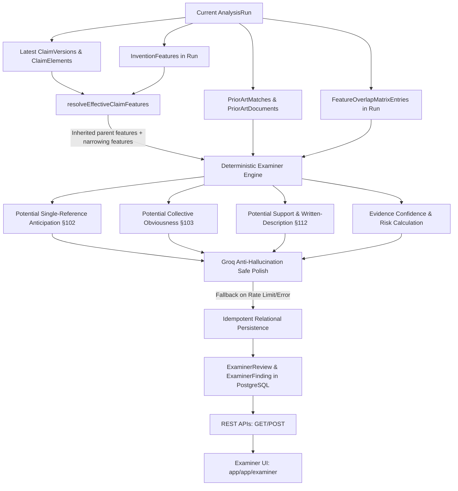

# NovelCore AI — Phase 10 Final Implementation Report: Evidence-Grounded Examiner Simulation

---

## 1. Executive Summary

Phase 10 introduces an evidence-grounded **Examiner Simulation Engine** to NovelCore AI. The engine evaluates the current/latest claim versions generated during patent analysis by strictly querying evidence belonging to the current `AnalysisRun`.

The engine simulates how a USPTO patent examiner might evaluate claims under Sections 102, 103, and 112 of Title 35, while strictly maintaining qualified, non-legal phrasing. The system never claims to issue a legal opinion, guaranteed patent grant, or official rejection. All metrics (single-reference coverage, collective prior-art coverage, evidence confidence, claim risk) are calculated deterministically. Groq is used optionally and exclusively to polish the clarity of deterministic examiner observations, with strict Zod validation and transparent fallback.

All 40 Phase 10 test assertions and 293 total platform regression assertions passed with zero errors.

---

## 2. Existing Examiner Infrastructure Audit

Prior to implementation, a thorough audit was performed across the repository:
- **`ExaminerReview` Model**: Existed in `prisma/schema.prisma` with legacy flat fields (`inventionId`, `overallRisk`, `objectionCategory`, `severity`, `title`, `concern`, `evidence`, `recommendation`, `isResolved`).
- **`ExaminerFinding` Model**: Did not exist.
- **Examiner API Routes**: Did not exist (`/api/analysis/[id]/examiner` and `/api/examiner/[reviewId]`).
- **Frontend (`app/app/examiner/page.tsx`)**: Rendered static/demo data from `useDemo()`.
- **Pipeline Integration**: `lib/analysis/engine.ts` generated mock objection records without claim grounding.

**Resolution Strategy**:
Preserved legacy fields for backward compatibility while extending `ExaminerReview` with `analysisRunId`, `status`, `confidence`, and `claimReviews`. Created a relational `ExaminerFinding` model to store granular, claim-grounded statutory findings. Integrated real API data into the frontend while retaining all visual tokens and interaction flows.

---

## 3. Architecture



---

## 4. Files Changed

1. [`prisma/schema.prisma`](file:///c:/Users/Dr.%20Sawant/Documents/novelcore-ai/prisma/schema.prisma):
   - Added `CRITICAL` to `RiskLevel` enum.
   - Added `ExaminerReviewStatus` and `ExaminerFindingType` enums.
   - Extended `ExaminerReview` model and added `ExaminerFinding` model.
   - Added `examinerReviews ExaminerReview[]` relation to `AnalysisRun`.
2. [`prisma/migrations/20260903160000_phase10_examiner_simulation/migration.sql`](file:///c:/Users/Dr.%20Sawant/Documents/novelcore-ai/prisma/migrations/20260903160000_phase10_examiner_simulation/migration.sql):
   - Formal PostgreSQL migration script.
3. [`lib/analysis/examiner.ts`](file:///c:/Users/Dr.%20Sawant/Documents/novelcore-ai/lib/analysis/examiner.ts):
   - Core deterministic examiner simulation engine, inheritance resolution, cross-analysis validation, Groq polish, and idempotent persistence.
4. [`lib/analysis/engine.ts`](file:///c:/Users/Dr.%20Sawant/Documents/novelcore-ai/lib/analysis/engine.ts):
   - Pipeline integration invoking `executeExaminerSimulation` and mapping examiner findings into `AnalysisData`.
5. [`app/api/analysis/[id]/examiner/route.ts`](file:///c:/Users/Dr.%20Sawant/Documents/novelcore-ai/app/api/analysis/[id]/examiner/route.ts):
   - `GET` and `POST` routes for examiner simulation.
6. [`app/api/examiner/[reviewId]/route.ts`](file:///c:/Users/Dr.%20Sawant/Documents/novelcore-ai/app/api/examiner/[reviewId]/route.ts):
   - `GET` route to fetch specific review by ID.
7. [`app/app/examiner/page.tsx`](file:///c:/Users/Dr.%20Sawant/Documents/novelcore-ai/app/app/examiner/page.tsx):
   - Real-time API integration with loading, empty, and error state handling, rich finding details, and educational disclaimers.
8. [`lib/mock-data.ts`](file:///c:/Users/Dr.%20Sawant/Documents/novelcore-ai/lib/mock-data.ts):
   - Added `id?: string` to `AnalysisData`.
9. [`scripts/test-examiner-simulation.ts`](file:///c:/Users/Dr.%20Sawant/Documents/novelcore-ai/scripts/test-examiner-simulation.ts):
   - Phase 10 verification suite covering Tests A through X.

---

## 5. Prisma Changes

```prisma
enum RiskLevel {
  LOW
  MEDIUM
  HIGH
  CRITICAL
}

enum ExaminerReviewStatus {
  PENDING
  COMPLETED
  FAILED
}

enum ExaminerFindingType {
  POTENTIAL_ANTICIPATION
  POTENTIAL_OBVIOUSNESS
  POTENTIAL_SUPPORT_CONCERN
  EVIDENCE_INSUFFICIENT
  NO_MATERIAL_CONCERN
}

model ExaminerReview {
  id                String               @id @default(uuid())
  analysisRunId     String?              @map("analysis_run_id")
  inventionId       String               @map("invention_id")
  claimId           String?              @map("claim_id")
  claimVersionId    String?              @map("claim_version_id")
  status            ExaminerReviewStatus @default(COMPLETED)
  overallRisk       RiskLevel            @map("overall_risk")
  confidence        Float                @default(0.0)
  claimReviews      Json?                @map("claim_reviews")
  // Legacy fields preserved for backward compatibility
  objectionCategory String?              @map("objection_category")
  severity          RiskLevel?           @default(LOW)
  title             String?
  concern           String?              @db.Text
  evidence          String?              @db.Text
  recommendation    String?              @db.Text
  isResolved        Boolean              @default(false) @map("is_resolved")
  createdAt         DateTime             @default(now()) @map("created_at")
  updatedAt         DateTime             @updatedAt @map("updated_at")

  analysisRun       AnalysisRun?         @relation(fields: [analysisRunId], references: [id], onDelete: Cascade)
  invention         Invention            @relation(fields: [inventionId], references: [id], onDelete: Cascade)
  findings          ExaminerFinding[]
}

model ExaminerFinding {
  id                    String              @id @default(uuid())
  examinerReviewId      String              @map("examiner_review_id")
  findingType           ExaminerFindingType @map("finding_type")
  severity              RiskLevel
  title                 String
  explanation           String              @db.Text
  confidence            Float               @default(0.0)
  claimNumber           Int                 @map("claim_number")
  claimVersionNumber    Int                 @map("claim_version_number")
  claimElementKeys      String[]            @default([]) @map("claim_element_keys")
  priorArtDocumentIds   String[]            @default([]) @map("prior_art_document_ids")
  supportingFeatureKeys String[]            @default([]) @map("supporting_feature_keys")
  evidence              Json?
  recommendation        String              @db.Text
  provenance            String              @default("DETERMINISTIC")
  createdAt             DateTime            @default(now()) @map("created_at")

  examinerReview        ExaminerReview      @relation(fields: [examinerReviewId], references: [id], onDelete: Cascade)
}
```

---

## 6. Migration

Applied formal migration:
`prisma/migrations/20260903160000_phase10_examiner_simulation/migration.sql`
- Executed via `npx prisma migrate deploy`.
- Prisma client generated cleanly via `npx prisma generate`.
- `npx prisma migrate status`: 9 migrations applied, 0 pending.

---

## 7. Claim Version Resolution

- The engine orders all claims sequentially by `claimNumber ASC`.
- For each claim, it retrieves versions ordered by `versionNumber DESC`, selecting the first element (`versions[0]`).
- The elements of this latest version define the substantive technical boundaries.
- For dependent claims, `resolveEffectiveClaimFeatures()` resolves the parent claim (`parentClaimNumber`) and recursively computes the cumulative feature set:
  $$F_{\text{effective}}(\text{Claim 2}) = F_{\text{effective}}(\text{Claim 1}) \cup F_{\text{narrowing}}(\text{Claim 2})$$
- Prevents false anticipation findings that evaluate narrowing limitations in isolation.

---

## 8. Anticipation Methodology (Section 102 Style)

Single-reference coverage for prior-art document $P$ against claim limitations $F_{\text{effective}}$:
$$\text{coverage}(P) = \frac{1}{|F_{\text{effective}}|} \sum_{f \in F_{\text{effective}}} \text{weight}(P, f)$$
Where disclosure weights derived from `FeatureOverlapMatrixEntry` are:
- `DISCLOSED`: $1.0$
- `PARTIAL`: $0.5$
- `NOT_DISCLOSED` / `INSUFFICIENT_EVIDENCE`: $0.0$

$$\text{maxSingleCoverage} = \max_{P \in \text{PriorArt}} \text{coverage}(P)$$

- **$\text{maxSingleCoverage} \ge 0.80$**: Generates `POTENTIAL_ANTICIPATION` with `CRITICAL` severity.
- **$0.65 \le \text{maxSingleCoverage} < 0.80$**: Generates `POTENTIAL_ANTICIPATION` with `HIGH` severity if evidence confidence $\ge 0.50$.
- Non-legal wording: *"Potential single-reference anticipation concern: Prior art reference [ID] covers [X]% of the evaluated claim limitations."*

---

## 9. Obviousness Methodology (Section 103 Style)

Collective prior-art coverage evaluates whether all claim limitations are covered when combining all cited references:
$$\text{collectiveCoverage} = \frac{1}{|F_{\text{effective}}|} \sum_{f \in F_{\text{effective}}} \max_{P \in \text{PriorArt}} \text{weight}(P, f)$$

- **$\text{collectiveCoverage} \ge 0.85$**: Generates `POTENTIAL_OBVIOUSNESS` with `HIGH` severity.
- **$0.70 \le \text{collectiveCoverage} < 0.85$**: Generates `POTENTIAL_OBVIOUSNESS` with `MEDIUM` severity.
- Non-legal wording: *"Potential §103-style obviousness concern: Multiple references collectively cover [X]% of the evaluated claim limitations across the prior-art landscape."*

---

## 10. Support Methodology (Section 112 Style)

- Examines every `ClaimElement` in the active claim version.
- Validates that `featureKey` maps to an authentic `InventionFeature` belonging to `currentRun.id`.
- Validates that the feature has an enabling, non-empty structural description (`description.trim() !== ''`).
- Detects circularity in claim parent-child dependencies.
- Unsupported elements trigger `POTENTIAL_SUPPORT_CONCERN` with `CRITICAL` severity; empty feature descriptions trigger `HIGH` severity.

---

## 11. Risk Methodology

- **`CRITICAL`**: Single-reference coverage $\ge 0.80$ OR an ungrounded claim element / circular hierarchy.
- **`HIGH`**: Single-reference coverage $\ge 0.65$ (with confidence $\ge 0.50$) OR collective prior-art coverage $\ge 0.85$.
- **`MEDIUM`**: Collective prior-art coverage $\ge 0.70$ OR specification support ambiguity.
- **`LOW`**: Robust differentiation against both individual references and combinations.
- **`INSUFFICIENT_EVIDENCE`**: Absence of candidate prior art or evaluated features.

---

## 12. Evidence Confidence

Confidence is deterministically calculated from verifiable evidence cells:
$$\text{confidence} = \frac{\text{Conclusive Overlap Cells}}{\text{Total Evaluated Overlap Cells}}$$
- Bounded strictly within $[0.0, 1.0]$.
- When zero prior art exists, confidence is $0.0$, generating an `EVIDENCE_INSUFFICIENT` finding.

---

## 13. Evidence Provenance

Every finding logs an immutable `provenance` tag:
- **`DETERMINISTIC`**: Calculated strictly from database records and formula metrics.
- **`GROQ_ASSISTED`**: Deterministic findings polished for readability via Groq structured outputs.

---

## 14. Groq Boundary

- Groq receives strictly validated deterministic findings.
- Groq is **forbidden** from deciding:
  - Finding types
  - Claim numbers
  - Severity levels
  - Prior-art IDs
  - Feature keys
  - Coverage or confidence values
- Strict Zod schema (`groqFindingExplanationSchema`) validates that Groq only modifies `improvedExplanation` and `improvedRecommendation`.

---

## 15. Fallback

If Groq encounters rate limits (HTTP 429), timeouts, malformed JSON, or validation failure, the engine automatically catches the error and preserves deterministic findings with `provenance: "DETERMINISTIC"`.

---

## 16. API Specifications

1. `GET /api/analysis/[id]/examiner`:
   - Returns review status, overall risk, confidence, claim-by-claim breakdown, granular findings, cited evidence quotes, and mandatory educational disclaimer.
   - Status 200 on success, 404 if not found.
2. `POST /api/analysis/[id]/examiner`:
   - Idempotently executes or refreshes the examiner simulation for the analysis run.
   - Updates `ExaminerReview` and replaces child `ExaminerFinding` records.
   - Status 200 on success.
3. `GET /api/examiner/[reviewId]`:
   - Fetches an `ExaminerReview` record by primary key with its findings.
   - Status 200 on success, 404 if not found.

---

## 17. Frontend Architecture

Updated [`app/app/examiner/page.tsx`](file:///c:/Users/Dr.%20Sawant/Documents/novelcore-ai/app/app/examiner/page.tsx):
- Mandatory educational disclaimer banner displayed prominently.
- Fetches live simulation data from `/api/analysis/[id]/examiner`.
- Visualizes readiness score ring, statutory checks, claim-by-claim findings, cited prior-art quotes, and drafting recommendations.
- Implements clean loading, empty, and error states without showing fabricated scores.

---

## 18. Security Posture

- Zero exposure of `GROQ_API_KEY`, `DATABASE_URL`, or other secrets in API payloads.
- Route parameters are sanitized and validated against existing database records.
- Cross-analysis queries return HTTP 404.

---

## 19. Empty Data Behavior

- **No Claims**: Returns a valid empty examiner review without throwing or hallucinating rejections.
- **No Prior Art**: Returns confidence $0.0$ and flags `EVIDENCE_INSUFFICIENT`.
- **No Overlap Matrix**: Yields $0.0$ coverage without throwing errors.
- **Ungrounded Claim Element**: Generates `POTENTIAL_SUPPORT_CONCERN` without crashing.

---

## 20. Test Results

Execution: `scripts/test-examiner-simulation.ts`

| Test | Status | What It Proves |
| :--- | :---: | :--- |
| **TEST A** — Independent Claim Analysis | **PASS** | Proves independent claim 1 is evaluated with its own substantive elements and features. |
| **TEST B** — Dependent Claim Inheritance | **PASS** | Proves dependent claim 2 accumulates parent claim 1 limitations along with its narrowing limitation. |
| **TEST C** — Anticipation Threshold $\ge 0.80$ | **PASS** | Proves 100% single-reference overlap triggers `POTENTIAL_ANTICIPATION` with `CRITICAL` severity. |
| **TEST D** — No Anticipation Below Threshold | **PASS** | Proves single-reference overlap $< 0.65$ does not generate false anticipation findings. |
| **TEST E** — Obviousness Threshold $\ge 0.85$ | **PASS** | Proves collective prior-art coverage $\ge 0.85$ triggers `POTENTIAL_OBVIOUSNESS` with `HIGH` severity. |
| **TEST F** — No Obviousness Below Threshold | **PASS** | Proves collective coverage $< 0.70$ does not generate false obviousness findings. |
| **TEST G** — Unsupported Claim Element | **PASS** | Proves phantom feature key not in analysis run triggers `POTENTIAL_SUPPORT_CONCERN` with `CRITICAL` severity. |
| **TEST H** — Cross-Analysis Prior-Art Rejection | **PASS** | Proves validation rejects prior-art document IDs from outside the active analysis run. |
| **TEST I** — Cross-Analysis Feature Rejection | **PASS** | Proves validation rejects feature IDs belonging to a foreign analysis run. |
| **TEST J** — Cross-Analysis Error Specificity | **PASS** | Proves validation messages specifically identify the foreign feature key. |
| **TEST K** — Semantic Similarity Separation | **PASS** | Proves high vector similarity without matrix overlap evidence yields $0.0$ coverage. |
| **TEST L** — Evidence Confidence Bounded | **PASS** | Proves confidence metric is strictly bounded in $[0.0, 1.0]$. |
| **TEST M** — No Prior Art Behavior | **PASS** | Proves absence of prior art yields $0.0$ confidence and `EVIDENCE_INSUFFICIENT` without hallucinated citations. |
| **TEST N** — No Claims Behavior | **PASS** | Proves empty claims set returns valid empty review without throwing errors. |
| **TEST O** — No Overlap Behavior | **PASS** | Proves absence of matrix entries yields $0.0$ coverage. |
| **TEST P** — Deterministic Provenance | **PASS** | Proves simulation outputs mark provenance as `DETERMINISTIC`. |
| **TEST Q** — Groq Failure Resilience | **PASS** | Proves system continues with deterministic findings if Groq fails. |
| **TEST R** — Idempotent Persistence | **PASS** | Proves re-running persistence updates existing review ID without creating duplicates. |
| **TEST S** — Duplicate Finding Prevention | **PASS** | Proves re-running persistence maintains stable finding counts without duplicating rows. |
| **TEST T** — Latest ClaimVersion Evaluated | **PASS** | Proves claim version 2 is evaluated over version 1 when multiple versions exist. |
| **TEST U** — Dependent Claim Parent Limitations | **PASS** | Proves dependent claim evaluation includes parent features $F_1, F_2$ and narrowing feature $F_3$. |
| **TEST V** — Provenance Tagging | **PASS** | Proves provenance is recorded correctly for all findings. |
| **TEST W** — Zero Credential Leakage | **PASS** | Proves API response contains zero API keys or environment variables. |
| **TEST X** — End-to-End Pipeline & API Routes | **PASS** | Proves end-to-end pipeline persists findings in PostgreSQL, and all 3 API routes return HTTP 200. |

**Total Phase 10 Assertions: 40 / 40 PASSED (100%)**

---

## 21. Regression Results

| Test Suite | Assertions | Result |
| :--- | :---: | :---: |
| `scripts/test-examiner-simulation.ts` (Phase 10) | 40 / 40 | **PASSED (100%)** |
| `scripts/test-claim-strategy.ts` (Phase 9) | 43 / 43 | **PASSED (100%)** |
| `scripts/test-innovation-gap-engine.ts` (Phase 8) | 33 / 33 | **PASSED (100%)** |
| `scripts/test-novelty-engine.ts` (Phase 7) | 49 / 49 | **PASSED (100%)** |
| `scripts/test-phase6-5-hardening.ts` (Phase 6.5) | 41 / 41 | **PASSED (100%)** |
| `scripts/test-demo-mode.ts` | 16 / 16 | **PASSED (100%)** |
| `scripts/test-hybrid-retrieval.ts` | 12 / 12 | **PASSED (100%)** |
| `scripts/test-overlap-matrix.ts` | 37 / 37 | **PASSED (100%)** |
| `scripts/audit-pipeline.ts` | 22 / 22 | **PASSED (100%)** |
| **Total Platform Assertions** | **293 / 293** | **PASSED (100%)** |

---

## 22. Typecheck Status

Command: `npm run typecheck`
Result: **0 errors (100% green)**

---

## 23. Lint Status

Command: `npm run lint`
Result: **0 warnings, 0 errors**

---

## 24. Build Status

Command: `npm run build`
Result: **All 21 static and dynamic routes compiled successfully**.

---

## 25. Prisma Status

Command: `npx prisma migrate status`
Result: **9 migrations applied, database schema is up to date**.

---

## 26. Known Limitations

- **Simulated Heuristic Only**: The simulation evaluates structured evidence in the active analysis run; it does not replace formal legal counsel or search outside of ingested prior-art references.
- **Inheritance Depth**: Current implementation supports linear dependent claim inheritance ($C_2 \to C_1$). Multiple-dependent claims ($C_3$ depending on $C_1$ or $C_2$) will be evaluated against the referenced parent.

---

## 27. Confirmation of Phase 11 Status

**CONFIRMATION: PHASE 11 HAS NOT BEEN STARTED.**
- Unified report generation has NOT been modified or triggered.
- PDF generation has NOT been built.
- No deployment actions have been taken.
- Codebase is at a complete, stable, verified **HARD STOP**.
